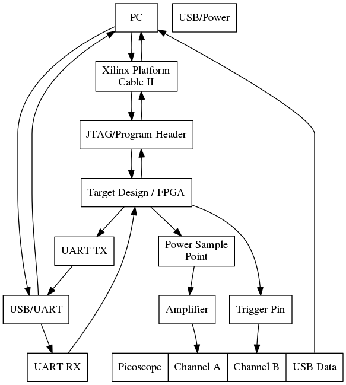

# SASS-RIG

This is the SCARV Side channel AnalySis Suite Rig.

It is used to automate the generation, running, analysis and archiving of
encryption/decription artifacts.

## Getting Started

In order to connect to the picoscope, follow the instructions
[here](https://www.picotech.com/downloads) to install the drivers for your
system and scope model. This flow was developed using the
PicoScope 5000 series.

These commands will get you setup and running with the flow. Setting up the
physical test rig is not documented here, but a link will be forthcoming.

The framework is essentially a set of Python modules with a shell interface
wrapped around them. This makes it very easy to setup repeatable 
*capture -> process -> analyse* flows. For examples of automating sample
capture, look in the `examples/` folder.

### Checking everything out

```sh
$> git clone https://github.com/scarv/sass-rig.git
$> cd sass-rig
$> sudo pip3 install -r requirements.txt
$> ./shell.py --help

usage: shell.py [-h] [-v] [-V] [--port PORT] [--baud BAUD] [--source SOURCE]

optional arguments:
  -h, --help       show this help message and exit
  -v               Turn on verbose logging.
  -V               Turn on very verbose logging.
  --port PORT      Target serial port to use
  --baud BAUD      Baud rate for the serial port.
  --source SOURCE  A script file to source and run

```


### Running the shell

Note: you don't need to be connected to a scope or target device in order
to run things like CPA attacks or TTest evaluations. You can run those
commands so long as you have the data in the correct `.trs` format.

```

$> ./shell.py

    ================================================
              SCARV Acquisitions Framework
    ================================================

afw> help

Documented commands (type help <topic>):
========================================
capture_traces     disconnect                scope_cfg_channel
capture_ttest      encrypt                   scope_cfg_trace_channel
ciphertext_get     evaluate_ttest            scope_cfg_trigger
connect            exit                      scope_close
connection_info    factor_samples_per_trace  scope_open
connection_test    find_sample_rate          set_samples_per_trace
cpa_attack         help                      trace_energy_aggregate
custom_target_cmd  key_get                   trace_info
decrypt            message_get

afw>
```


## Test Rig Setup

The diagram below shows the components of the test rig used to develop this
flow.



## Organisation

The rig is split into two components:

- The host side runs the scripts found in `sassrig/`, which are responsible
  for controlling the target.
- The target uses the C code found in `target/` to interface with the host
  program and act according to what it is told to do.

## Capabilities

- Message, Key and Ciphertext generation
- Testbench Communication
  - Key/Message/Ciphertext upload / download.
  - Configuration setting
- Scope / Probe control
  - Trace configuration
  - Trigger configuration
  - Trace capture and compression
- Flow Coordination

